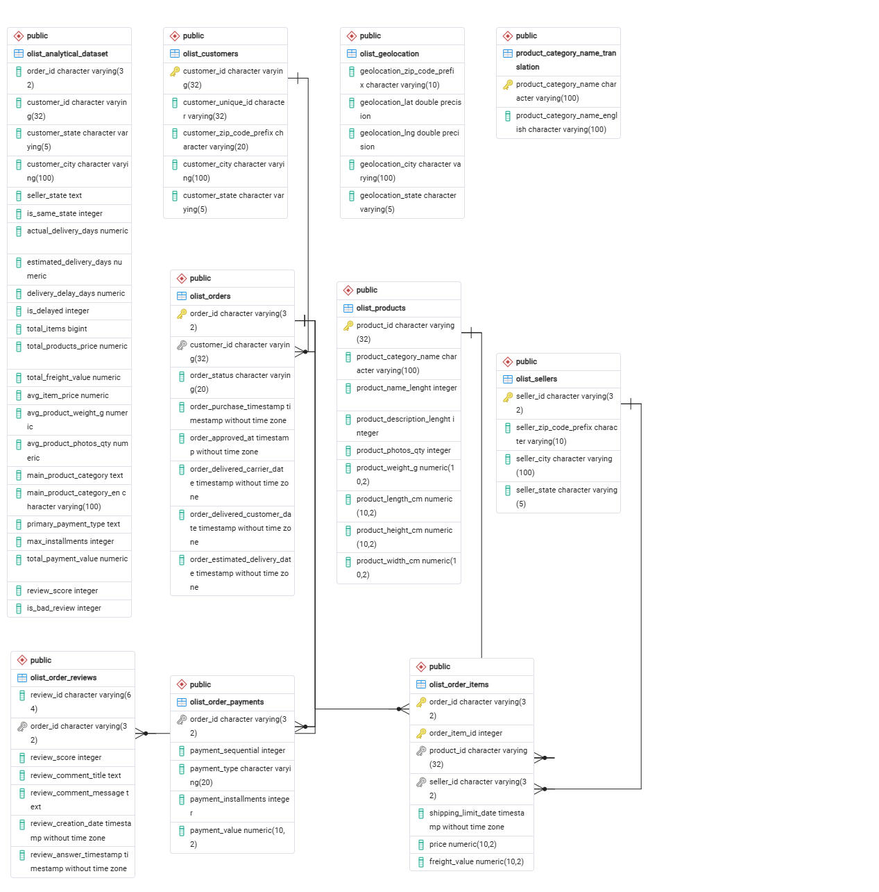

# 🛒 Capstone Project: Предсказание низких оценок заказов на маркетплейсе Olist

## 📌 О проекте и Бизнес-задача
Данный проект направлен на анализ данных бразильского маркетплейса **Olist** (2016–2018 гг.).
**Цель:** выявить ключевые факторы (сроки доставки, сумма покупки, категории товаров и др.), которые приводят к низкой оценке клиента (1–2 звезды из 5), и построить модель машинного обучения для предсказания таких оценок до их фактического выставления.

## 🛠 Стек технологий
* **База данных:** PostgreSQL
* **Язык программирования:** Python
* **Библиотеки:** Pandas, NumPy, Matplotlib, Seaborn, Scikit-learn

## 📂 Структура проекта
1. **База данных и SQL:** Формирование единой витрины данных из 9 исходных таблиц.
2. **EDA (Разведочный анализ):** Изучение распределений, обработка пропусков и визуализация инсайтов.
3. **Подготовка целевой переменной:** Переход к бинарной классификации (0 — хороший отзыв, 1 — плохой отзыв).
4. **Машинное обучение:** Обучение Logistic Regression и Random Forest с обработкой сильного дисбаланса классов (`class_weight='balanced'`).

## 📊 Изначальный Датасет

[Brazilian E-Commerce Public Dataset by Olist](https://www.kaggle.com/datasets/olistbr/brazilian-ecommerce) — реальные анонимные данные, 9 связанных CSV-таблиц:

| Таблица | Содержание |
|---|---|
| `olist_orders_dataset` | заказы: даты покупки, отправки, доставки, статус |
| `olist_order_items_dataset` | позиции заказа: цена, стоимость доставки, продавец |
| `olist_order_payments_dataset` | способ и сумма оплаты |
| `olist_order_reviews_dataset` | оценка 1–5 (целевая переменная) |
| `olist_customers_dataset` | клиенты, город/штат |
| `olist_products_dataset` | категория, вес, габариты товара |
| `olist_sellers_dataset` | продавцы, город/штат |
| `olist_geolocation_dataset` | координаты почтовых индексов |
| `product_category_name_translation` | перевод категорий на английский |

> Датасет не хранится в репозитории (см. `.gitignore`). Инструкция по загрузке — ниже.

## 📊 Описание данных (Data Dictionary)
В проекте используется [Brazilian E-Commerce Public Dataset by Olist](https://www.kaggle.com/datasets/olistbr/brazilian-ecommerce). Итоговый аналитический датасет `olist_analytical_dataset.csv`, собранный с помощью SQL-запросов, содержит следующие поля:

| Признак | Описание |
|---|---|
| `order_id` | Уникальный идентификатор заказа |
| `customer_id` | Уникальный идентификатор клиента |
| `customer_state` / `customer_city` | Штат и город доставки клиента |
| `seller_state` | Штат отправки продавца |
| `is_same_state` | Флаг (1/0): находятся ли клиент и продавец в одном штате |
| `actual_delivery_days` | Фактическое время доставки (в днях от заказа до вручения) |
| `estimated_delivery_days` | Обещанное (ожидаемое) время доставки при оформлении |
| `delivery_delay_days` | Разница в днях (фактическое минус обещанное). Отрицательные — доставили раньше |
| `is_delayed` | Флаг (1/0): была ли задержка доставки |
| `total_items` | Общее количество товаров в заказе |
| `total_products_price` | Общая стоимость товаров (без доставки) |
| `total_freight_value` | Стоимость доставки (фрахт) |
| `avg_item_price` | Средняя стоимость одного товара в заказе |
| `avg_product_weight_g` | Средний вес товаров в граммах |
| `main_product_category_en` | Основная категория товара (на английском) |
| `primary_payment_type` | Основной способ оплаты (credit_card, boleto и т.д.) |
| `max_installments` | Максимальное количество платежей (при рассрочке) |
| `total_payment_value` | Общая сумма оплаты заказа |
| `review_score` | Оригинальная оценка заказа (1-5 звезд) |
| `is_bad_review` | **Целевая переменная** (1 — плохой отзыв 1-2 звезды, 0 — хороший/нейтральный) |
> Итоговвая таблица не хранится в репозитории (см. `.gitignore`). Инструкция по загрузке — ниже.

## 🗄 Схема базы данных
Все исходные таблицы были загружены в PostgreSQL (`olist.db`).


## 📁 Структура репозитория
```text
olist/
├── DataGroup_Capstone_Akmaral_Kudaibergen.ipynb   # Основной код: SQL, EDA, ML
├── DataGroup_Capstone_Akmaral_Kudaibergen.pdf     # Презентация для защиты (PDF)
├── DataGroup_Capstone_Akmaral_Kudaibergen.pptx    # Исходник презентации (PowerPoint)
├── olist_analytical_dataset.csv                   # Итоговый датасет (скрыт в .gitignore)
├── .gitignore                                     # Исключения файлов
└── README.md                                      # Описание проекта
```

## 🚀 Как запустить
1. Склонируйте репозиторий:
   ```bash
   git clone https://github.com/akmaral1999/datagroup.kz-olist-capstone-project.git
   cd olist
   ```
2. Скачайте исходный датасет с Kaggle и поместите 9 CSV-файлов в корень репозитория.
3. Откройте `DataGroup_Capstone_Akmaral_Kudaibergen.ipynb` в Google Colab или Jupyter Notebook и запустите ячейки.

## 📈 Результаты
* **Лучшая модель:** Random Forest.
* **Метрики качества:** ROC-AUC: **0.74**, F1-score (для миноритарного класса): **0.40**.
* *(Примечание: Accuracy не использовалась из-за сильного дисбаланса, приоритет отдан полноте нахождения негативных кейсов).*
* **Топ-3 фактора, влияющих на негативные отзывы:**
  1. Разница между обещанной и фактической датой доставки (`delivery_delay_days`).
  2. Общее время от заказа до получения (`actual_delivery_days`).
  3. Стоимость доставки (`total_freight_value`).

## 💡 Рекомендации для бизнеса
1. **Оптимизация логистики:** Главный триггер негатива — задержка доставки. Устанавливайте более реалистичные (пусть и чуть более длинные) сроки доставки на этапе оформления заказа.
2. **Управление ожиданиями:** Контролируйте тарифы на доставку. Высокая стоимость фрахта формирует завышенные ожидания, и малейшие сбои в логистике приводят к 1-2 звездам.

---
**Автор:** Акмарал Кудайберген - [GitHub](https://github.com/akmaral1999/)  
Поток 3 Data Science в Datagroup.kz
